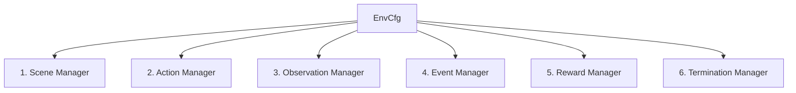

# 📘 คู่มือการออกแบบและการตั้งค่าโครงการ (G1 Bimanual Reaching Setup Guide)

คู่มือนี้อธิบายสถาปัตยกรรมการออกแบบโครงการ **G1 Bimanual Pose Reaching** ตั้งแต่เริ่มต้นโครงสร้างโฟลเดอร์ การใช้งานไลบรารี Isaac Lab / Isaac Sim และการทำงานของระบบควบคุมสภาพแวดล้อมโดยใช้โครงสร้าง **Manager-Based RL Environment** แบบใหม่

---

## 📂 1. โครงสร้างของโครงการ (Project Directory Layout)

โครงการได้รับการจัดกลุ่มไฟล์ออกเป็นระบบโมดูลาร์ เพื่อการขยายผลและแก้ไขที่ง่าย:

```
g1_bimanual_pose_project/
├── env_cfg.py          # ⚙️ ไฟล์คอนฟิกหลักที่รวบรวมระบบจำลองทั้งหมด (จุดเชื่อมต่อหลัก)
├── train.py            # 🏋️ สคริปต์สำหรับการเริ่มฝึกอบรมด้วย RSL-RL PPO
├── play.py             # 🎮 สคริปต์สำหรับรันประเมิน/เล่นนโยบาย (Inference)
├── cheatsheet.md       # 📋 สรุปคำสั่งลัดที่ใช้งานบ่อย
├── setup_guide.md      # 📘 ไฟล์อธิบายการตั้งค่าและการออกแบบระบบ (ไฟล์นี้)
└── mdp/                # 🧠 ส่วนคณิตศาสตร์และตรรกะของสภาพแวดล้อม (Markov Decision Process)
    ├── __init__.py     # เชื่อมโยงและส่งออกฟังก์ชัน MDP ทั้งหมดเข้าสู่ระบบหลัก
    ├── observations.py # คำนวณ Observation (ทิศทาง/ตำแหน่งสัมพัทธ์ของมือและเป้าหมาย)
    ├── rewards.py      # คำนวณฟังก์ชันรางวัลแบบหนาแน่น (Dense Tanh Rewards)
    └── events.py       # จัดการ Domain Randomization และ Curriculum Spawning
```

---

## 🏛️ 2. รู้จักกับโครงสร้าง Manager-Based RL Environment

Isaac Lab ใช้สถาปัตยกรรม **Manager-Based RL Environment** เพื่อสร้างข้อกำหนดการเรียนรู้ของระบบจำลอง โดยจะรวบรวมองค์ประกอบย่อยออกเป็น 6 ส่วนหลัก (Managers) ภายใต้ Class `G1BimanualReacherEnvCfg`:



### 1. Scene Manager (`G1BimanualSceneCfg`)
ทำหน้าที่สร้างวัตถุ (Spawning Assets) ลงบน PhysX Simulator และกำหนดโครงสร้างพิกัด:
* **หุ่นยนต์ G1 (`robot`)**: โหลดผ่านโมเดลทางการของ Unitree G1 (29 Degrees of Freedom) โดยล็อกฐานส่วนเชิงกราน (Pelvis base fixed) ไว้ที่ตำแหน่งกึ่งกลางฉากความสูง $Z = 0.75\text{ ม.}$ และเปิดระบบสัมผัส (Contact sensors) ทั่วตัว
* **โต๊ะจำลอง (`packing_table`)**: สร้างขึ้นด้านหน้าหุ่นยนต์ที่พิกัดสัมพัทธ์ $Y = 0.55\text{ ม.}$ และเปิดใช้งานระบบตรวจจับการชนทางฟิสิกส์ (`collision_enabled=True`) เพื่อให้มีขอบเขตพื้นผิวจริง
* **เป้าหมายพิกัดและตัวมาร์กเกอร์ข้อมือ (`left_target`, `right_target`, `left_ee_marker`, `right_ee_marker`)**: นำเข้าวัตถุ `frame_prim.usd` (แกนสีแดง-เขียว-น้ำเงินแทน XYZ) ขนาดเล็กลงครึ่งหนึ่ง (`scale=0.10`) เพื่อประเมินทิศทางเชิงภาพแบบเรียลไทม์

### 2. Action Manager (`ActionsCfg`)
ทำหน้าที่แปลงคำสั่ง Action (เอาต์พุตของนโยบาย RL) เป็นแรงควบคุมมอเตอร์ของหุ่นยนต์:
* **การใช้การควบคุมแบบสัมพัทธ์ (Relative / Delta Position Control)**: เปลี่ยนมาใช้งานตัวควบคุมข้อต่อเชิงมุมแบบสัมพัทธ์ `RelativeJointPositionActionCfg` โดยคำสั่งที่ส่งไปยังข้อต่อในแต่ละสเต็ปคือ:
  $$\text{applied\_action} = \text{current\_joint\_positions} + \text{action} \times \text{scale}$$
  * **เหตุผลการใช้**: เดิมทีกรณีใช้แบบระบุตำแหน่งคงที่ (Absolute Position Offset) หุ่นยนต์จะถูกจำกัดให้อยู่ห่างจากมุมข้อต่อยืนเริ่มต้นได้ไม่เกิน $\pm \text{scale}$ ทำให้ไม่สามารถเอื้อมมือออกไปไกลกว่าขอบเขตจำกัดได้ และส่งผลให้หุ่นยนต์ขยับนิดเดียวแล้วหยุดนิ่ง (Freeze) เมื่อเป้าหมายค่อยๆ ห่างออกไปตามขั้นตอน Curriculum
  * **การจำกัดความเร็วและช่วงสะสม**: การเปลี่ยนเป็นระบบสัมพัทธ์ (Delta) ร่วมกับการใช้ `scale=0.05` ทำให้หุ่นยนต์สะสมสะท้อนทิศทางการเคลื่อนขยับไหล่, ข้อศอก, และข้อมือ ได้อย่างเสถียร สมบูรณ์ตลอดพิสัยขอบเขตข้อต่อ (Full Range of Motion) และมีความเร็วสูงสุดที่เหมาะสมในการเคลื่อนขยับ ($0.05 \text{ rad/step} \times 30\text{ steps/s} = 1.5\text{ rad/s}$ หรือประมาณ $85^\circ/\text{s}$) เพื่อความปลอดภัยของกลไกหุ่นยนต์จริง

### 3. Observation Manager (`ObservationsCfg`)
ทำหน้าที่รวบรวมข้อมูลสถานะส่งไปให้โครงข่ายประสาท (Policy) นำไปคำนวณเอาต์พุต:
* **มิติข้อมูลรวม 87 มิติ (87 Dimensions Input)** ประกอบด้วย:
  * องศาและความเร็วปัจจุบันของข้อต่อแขน 14 จุด (`joint_pos`, `joint_vel` - สัมพัทธ์)
  * ตำแหน่งและทิศทางมุม (Relative Position & Quaternion) ของเป้าหมายซ้าย/ขวา เทียบกับ Pelvis
  * ตำแหน่งและทิศทางมุมของข้อมือปัจจุบัน (Left/Right Wrist links) เทียบกับ Pelvis
  * ข้อมูลการกระทำครั้งก่อนหน้า (`last_action`) เพื่อสร้างความนุ่มนวล
  * สถานะการชน/ปะทะกับตัวเองหรือโต๊ะทำงาน (`arm_contacts`)

### 4. Event Manager (`EventCfg`)
จัดการกฎการสุ่มในทุกๆ รอบใหม่ (Domain Randomization & Resets):
* **ตัวสุ่มข้อต่อ**: รีเซ็ตมุมข้อต่อมาตรฐานหุ่นยนต์ และสุ่มความเหลื่อมล้ำเล็กน้อย ($\pm 0.1\text{ rad}$) เพื่อให้ได้ท่าเริ่มต้นที่แตกต่างกัน
* **ระบบไต่ระดับความยาก (Curriculum Goal Spawning)**: ดำเนินการผ่านฟังก์ชัน `reset_target_curriculum` ใน [events.py](file:///g1_bimanual_pose_project/mdp/events.py) เพื่อเลื่อนพิกัดเป้าหมายจากจุดเริ่มต้นข้อมือหุ่นยนต์ออกไปยากขึ้นเมื่อจำนวนรอบการเรียนรู้รวมเพิ่มขึ้น

### 5. Reward Manager (`RewardsCfg`)
ตัวให้คะแนนเป้าหมายและจำกัดการกระทำผิดกฎ (Reward & Penalty Terms):
* **รางวัลระยะทาง (Distance Reward)**: ใช้สมการ Tanh เพื่อลดขนาดคะแนนจากมากไปหาน้อยเมื่อเข้าใกล้เป้าหมายในรัศมีวงกว้าง และเร่งความละเอียดระยะชิดเมื่อเข้าใกล้กว่าเดิมในระดับต่ำกว่า $5\text{ ซม.}$ (`left_distance_fine`)
* **รางวัลมุมแนวแกนตรงกัน (Orientation Alignment Reward)**: คำนวณมุมเบี่ยงเบนระหว่าง Quaternion ของเป้าหมายและข้อมือ โดยให้คะแนนเข้าใกล้ $1.5$ เมื่อแกน XYZ หมุนประจันหน้าตรงกันพอดี
* **บทลงโทษการชนอย่างรุนแรง (Undesired Contact Penalty)**: หักคะแนนอย่างรุนแรงครั้งละ `-5.0` หากตรวจพบว่าส่วนบอดี้ส่วนบน (ไหล่, ข้อศอก, ข้อมือ, เอว, อก) มีการสัมผัสหรือเบียดชนกันเอง หรือชนกับขอบโต๊ะ

### 6. Termination Manager (`TerminationsCfg`)
* **การหมดเวลาของลูปจำลอง (Timeout)**: กำหนดให้แต่ละรอบจำลองทำงานไม่เกิน 5 วินาทีจำลอง (`episode_length_s = 5.0`) จากนั้นจะถูกบังคับให้จบและเริ่มรอบใหม่

---

## 🛠️ 3. ไลบรารี Isaac Lab / Isaac Sim ที่จำเป็น

โครงการนี้ขับเคลื่อนด้วยโมดูลสำคัญของ Isaac Lab:

1. **`isaaclab.app.AppLauncher`**:
   คลาสสำคัญที่สุดที่ทำหน้าที่โหลดลูปรันการทำงานของ Omniverse Kit Simulator โดยตรง สเปคของแอพทั้งหมดจะต้องถูกระบุและรันผ่านคลาสนี้ก่อนการเรียกเข้าใช้ไลบรารี PyTorch เสมอ
2. **`isaaclab.sim`**:
   * `sim_utils.spawn_from_usd`: ใช้สปอนไฟล์ USD ยูทิลิตี้เข้าสู่ระบบจำลอง
   * `sim_utils.RigidBodyPropertiesCfg` และ `sim_utils.CollisionPropertiesCfg`: คอนฟิกระบบฟิสิกส์ การตัดแรงโน้มถ่วง หรือเปิดการปะทะ
3. **`isaaclab.assets.ArticulationCfg` & `RigidObjectCfg`**:
   กำหนดโมเดลหุ่นยนต์ที่มีระบบข้อต่อต่อพ่วงซับซ้อน (Articulation) และวัตถุแข็งลอยตัวเป็นอิสระ (Rigid Object)
4. **`isaaclab.utils.math`**:
   ชุดฟังก์ชันคณิตศาสตร์แปลงการเคลื่อนไหว 3 มิติเชิงรวดเร็วบน GPU (Cuda) เช่น:
   * `quat_apply_inverse`: แปลงเวกเตอร์พิกัดโลกให้เป็นเวกเตอร์สัมพัทธ์ของหุ่นยนต์
   * `quat_mul`, `quat_conjugate`: จัดการคูณและสลับทิศทางหมุนของ Quaternion
   * `sample_uniform`: สุ่มค่าตำแหน่งเชิงเส้นและเชิงมุมอย่างสม่ำเสมอในกรอบพิกัด Tensor

---

## 📐 4. สมการคณิตศาสตร์สำคัญในการออกแบบ

### 1. การคำนวณตำแหน่งและทิศทางสัมพัทธ์ (Relative Transform)
สำหรับแปลงพิกัดเวกเตอร์โลก $\mathbf{P}_w$ และควอเตอร์เนียน $\mathbf{q}_w$ ของข้อมือและเป้าหมาย ให้มาอยู่บนพิกัดของส่วนฐานหุ่นยนต์ (Pelvis) $\mathbf{P}_{\text{pelvis}}$, $\mathbf{q}_{\text{pelvis}}$ เพื่อให้ Policy เรียนรู้ได้อย่างแม่นยำไม่ว่าจะเกิดที่พิกัดใด:

$$\mathbf{P}_{\text{rel}} = \mathbf{q}_{\text{pelvis}}^{-1} \otimes (\mathbf{P}_w - \mathbf{P}_{\text{pelvis}})$$

$$\mathbf{q}_{\text{rel}} = \mathbf{q}_{\text{pelvis}}^{-1} \otimes \mathbf{q}_w$$

### 2. ฟังก์ชันรางวัลรูปแบบ Tanh (Tanh Density Reward)
เพื่อป้องกันคะแนนรางวัลพุ่งพรวดหรือเบาเกินไปจนการอัปเกรดนโยบายไม่เสถียร เราประยุกต์สูตร Tanh ครอบระยะคลาดเคลื่อน (Error) โดยมีค่าเบี่ยงเบนมาตรฐาน $\sigma$ เป็นตัวกรองความละเอียด:

$$R_{\text{dist}} = 1.0 - \tanh\left( \frac{\|\mathbf{P}_{\text{target}} - \mathbf{P}_{\text{wrist}}\|}{\sigma} \right)$$

* สำหรับระยะภาพกว้าง: $\sigma = 0.15$
* สำหรับระยะเกลี่ยละเอียดระยะชิด: $\sigma = 0.05$

### 3. การควบคุมระดับความยาก (Curriculum Linear Factor)
ตัวเลื่อนความยากของเป้าหมาย $\alpha$ จะคำนวณสัมพันธ์กับจำนวนขั้นตอนการเทรนทั้งหมด:

$$\alpha = \min\left(1.0, \frac{\text{common\_step\_counter}}{150000}\right)$$

พิกัดสุ่มเป้าหมายจะถูกสุ่มระยะเอียงและทิศทางภายใต้ช่วงดังนี้:

$$\text{pos\_limit} = 0.005 + \alpha \cdot (0.30 - 0.005) \quad \text{[เมตร]}$$

$$\text{rot\_limit} = 0.01 + \alpha \cdot (3.14159 - 0.01) \quad \text{[เรเดียน]}$$
